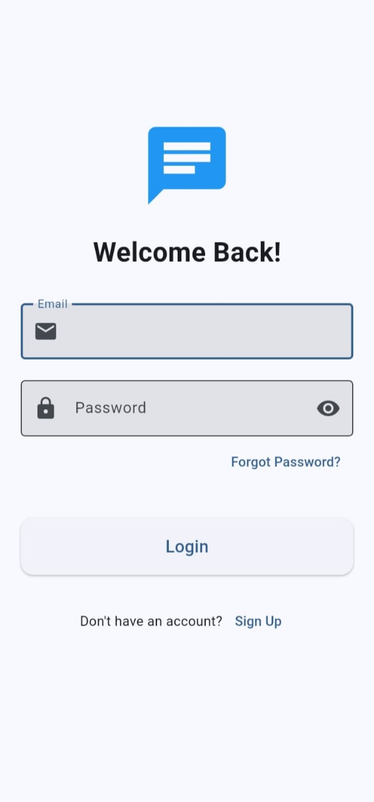
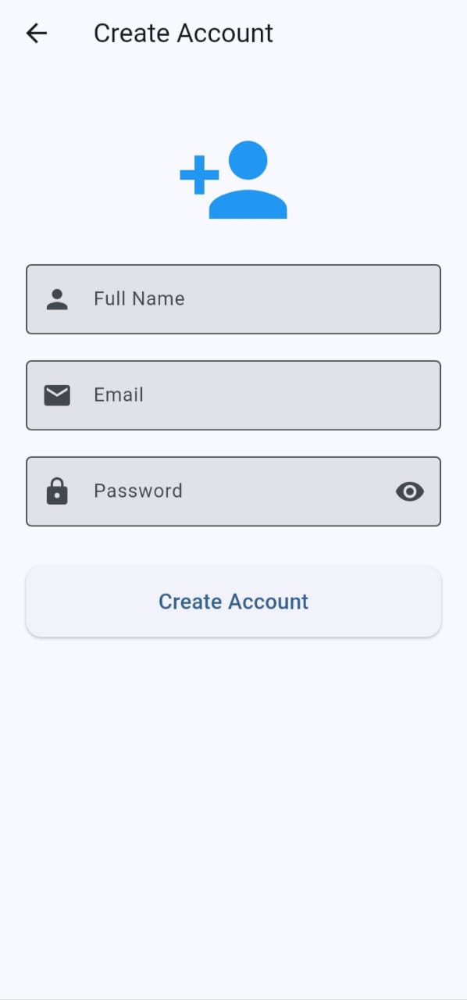
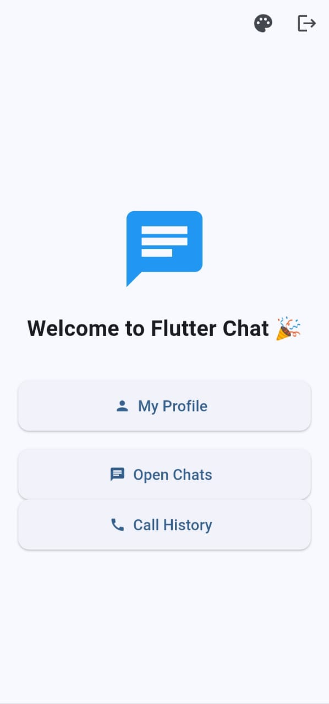
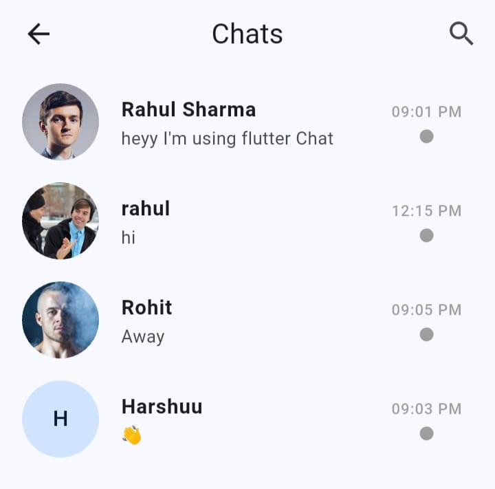
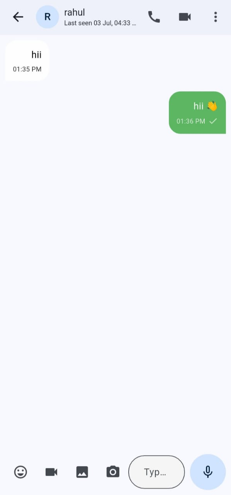

# 💬 Flutter Chat App

A modern real-time chat application built with **Flutter** and **Firebase**, featuring one-to-one messaging, voice & video calling, media sharing, push notifications, dark mode, and many WhatsApp-inspired features.


---

# ✨ Features

## 🔐 Authentication
- Firebase Authentication
- Email & Password Login
- User Registration
- Secure Logout

---

## 👤 User Profile
- Edit Profile
- Upload Profile Picture
- Online / Offline Status
- Last Seen
- Typing Indicator

---

## 💬 Real-Time Chat
- One-to-One Messaging
- Real-time Updates
- Read Receipts (✓✓)
- Message Timestamp
- Message Search
- Reply to Messages
- Forward Messages
- Delete for Me
- Delete for Everyone

---

## 📂 Media Sharing
- 📷 Images
- 🎤 Voice Messages
- 🎥 Video Messages
- Camera Capture
- Gallery Picker

---

## 📞 Calling
### Voice Call
- One-to-One Voice Calling
- Incoming Call Screen
- Outgoing Call Screen
- Mute Microphone
- Speaker Mode

### Video Call
- Agora Video Calling
- Local & Remote Video
- Switch Camera
- Mute Audio
- Speaker Toggle
- End Call

---

## 📜 Call History
- Incoming Calls
- Outgoing Calls
- Missed Calls
- Voice & Video Icons
- Call Duration
- Grouped by:
  - Today
  - Yesterday
  - Previous Dates
- Tap to Call Again

---

## 🎨 Chat Experience
- Custom Chat Wallpaper
- Remove Wallpaper
- Light Theme
- Dark Theme
- Material 3 UI

---

## 🔔 Notifications
- Firebase Cloud Messaging (FCM)
- Push Notifications
- Device Token Storage
- Background Notifications

---

## 🔍 Search
- Search Messages
- Highlight Search Result
- Auto Scroll to Message

---

## ⚡ Performance
- Stream-based UI
- Optimized Firestore Queries
- Lazy Loading
- Real-time Synchronization

---

# 🛠 Tech Stack

- Flutter
- Dart
- Firebase Authentication
- Cloud Firestore
- Firebase Storage
- Firebase Cloud Messaging
- Firebase Cloud Functions
- Agora RTC SDK
- Image Picker
- Record
- Just Audio
- Video Player
- Provider
- Shared Preferences

---

# 📂 Project Structure

```text
lib/
│
├── models/
├── services/
├── screens/
├── widgets/
├── utils/
├── firebase_options.dart
└── main.dart
```

---

# 📸 Screenshots

> Create a folder named **screenshots/** and place your images there.

## Login



---

## Register



---

## Home



---

## Chat



---

## Chat_screen




# 🚀 Getting Started

## Clone the repository

```bash
git clone https://github.com/your-username/flutter_chat_app.git
```

Move into the project directory

```bash
cd flutter_chat_app
```

Install dependencies

```bash
flutter pub get
```

Run the application

```bash
flutter run
```

---

# 🔥 Firebase Setup

1. Create a Firebase project.
2. Enable:
   - Authentication
   - Cloud Firestore
   - Firebase Storage
   - Cloud Messaging
3. Download:
   - `google-services.json` (Android)
   - `GoogleService-Info.plist` (iOS)
4. Configure Firebase using FlutterFire CLI.

---

# 📹 Agora Setup

1. Create an Agora project.
2. Copy your App ID.
3. Replace the App ID in:

```dart
VideoCallScreen
VoiceCallScreen
```

4. Enable RTC services in the Agora Console.

---

# 📌 Future Improvements

- ✅ Group Chat
- ✅ Group Voice Calls
- ✅ Group Video Calls
- ✅ Message Reactions
- ✅ Stories / Status
- ✅ Message Pinning
- ✅ Chat Backup
- ✅ End-to-End Encryption
- ✅ AI Chat Assistant
- ✅ Message Scheduling
- ✅ Screen Sharing
- ✅ File Sharing (PDF, DOCX, ZIP)
- ✅ Contact Sharing
- ✅ Stickers & GIFs

---

# 👨‍💻 Developer

**Gaurav Dhangar**

- GitHub: https://github.com/GauravDhangar-gd
- LinkedIn: https://www.linkedin.com/in/gaurav-dhangar/

---

# ⭐ Support

If you found this project helpful, please consider giving it a **⭐ Star** on GitHub.

It motivates me to continue building and sharing more open-source projects.

---

# 📄 License

This project is licensed under the **MIT License**.
